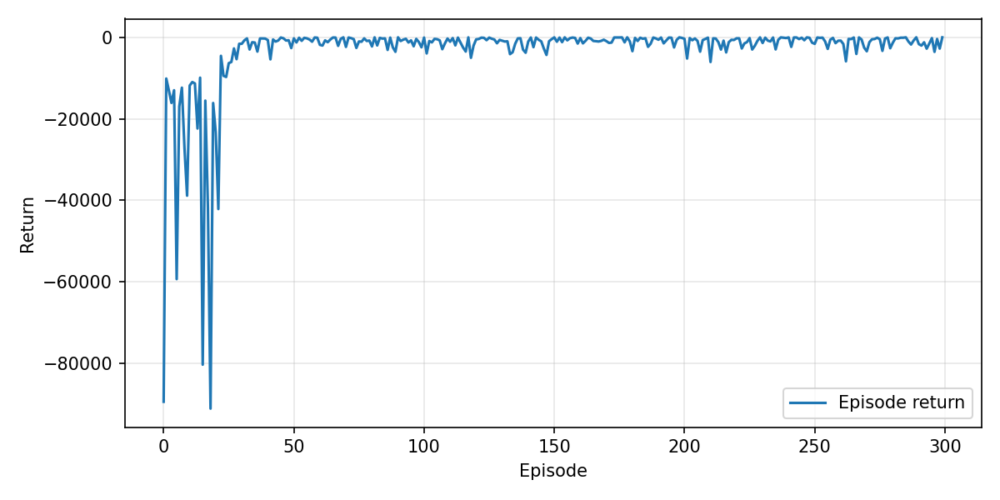

# Стабилизация одномерной точки с помощью Soft Actor-Critic

## Описание задачи

Рассматривается динамическая система — материальная точка на числовой прямой. Движение точки описывается уравнением двойного интегратора:

$$
\ddot{x} = u
$$

Агент управляет ускорением точки и должен стабилизировать систему в начале координат.

Вектор состояния определяется как

$$
s =
\begin{bmatrix}
x \
\dot{x}
\end{bmatrix}
\in \mathbb{R}^2
$$

где:

* $x$ — положение точки
* $\dot{x}$ — скорость точки

Управление задается скалярным действием

$$
u \in \mathbb{R}
$$

Динамика системы дискретизируется методом Эйлера:

$$
x_{t+1} = x_t + \dot{x}_t \Delta t
$$

$$
\dot{x}_{t+1} = \dot{x}_t + u_t \Delta t
$$

где $\Delta t = 0.05$.

Начальное состояние выбирается случайно:

$$
x_0 \sim \mathcal{U}(-10,10)
$$

$$
\dot{x}_0 \sim \mathcal{U}(-5,5)
$$

Целевое состояние системы

$$
s^* =
\begin{bmatrix}
0 \
0
\end{bmatrix}
$$

Функция вознаграждения определяется как

$$
r_t = - \left( \alpha x_t^2 + \beta \dot{x}_t^2 + \gamma u_t^2 \right)
$$

где:

* $\alpha = 1.0$ — штраф за отклонение от позиции
* $\beta = 0.1$ — штраф за скорость
* $\gamma = 0.001$ — штраф за управление

Эпизод завершается при выполнении одного из условий:

* достижение цели
* выход за границы (20)
* достижение максимального числа шагов (500)

## Используемый алгоритм

Для решения задачи используется алгоритм Soft Actor-Critic (SAC).

Алгоритм SAC является off-policy методом обучения с подкреплением, который максимизирует не только ожидаемое вознаграждение, но и энтропию политики.

Оптимизируемая функция имеет вид

$$
\pi^* = \arg\max_{\pi} \mathbb{E}\left[
\sum_{t=0}^{\infty} \gamma^t
\left(
r(s_t,a_t) + \alpha \mathcal{H}(\pi(\cdot|s_t))
\right)
\right]
$$

где:

* $\pi(a|s)$ — политика агента
* $r(s,a)$ — функция вознаграждения
* $\mathcal{H}(\pi)$ — энтропия политики
* $\gamma$ — коэффициент дисконтирования
* $\alpha$ — коэффициент энтропийной регуляризации

## Критик

В алгоритме используются два критика:

$$
Q_{\theta_1}(s,a), \quad Q_{\theta_2}(s,a)
$$

Целевое значение вычисляется как

$$
y = r + \gamma \left(
\min_{i=1,2} Q_{\theta_i'}(s',a') - \alpha \log \pi(a'|s')
\right)
$$

где:

* $Q_{\theta_i'}$ — target критики
* $a' \sim \pi(\cdot|s')$

Функция потерь критика:

$$
L(\theta_i) =
\mathbb{E}*{(s,a,r,s') \sim \mathcal{D}}
\left[
(Q*{\theta_i}(s,a) - y)^2
\right]
$$

где:

* $\mathcal{D}$ — replay buffer

## Актор

Функция потерь актора:

$$
L(\phi) =
\mathbb{E}*{s \sim \mathcal{D}}
\left[
\alpha \log \pi*\phi(a|s) -
\min_{i=1,2} Q_{\theta_i}(s,a)
\right]
$$

## Обновление target сетей

Target сети обновляются:

$$
\theta' \leftarrow \tau \theta + (1-\tau)\theta'
$$

где:

* $\tau$ — коэффициент сглаживания

## Процесс обучения

Алгоритм обучения:

* агент взаимодействует со средой
* переходы сохраняются в replay buffer
* из буфера случайно выбирается батч
* обновляются критики
* обновляется актор
* обновляются target сети

## Результаты обучения

График показывает зависимость награды на конец эпизода от номера эпизода во время обучения.

Метрики на валидации:

| Метрика            | Значение |
| ------------------ | -------- |
| Average return     | -895     |
| Success rate       | 100%     |
| Stabilization time | 4.69s    |
